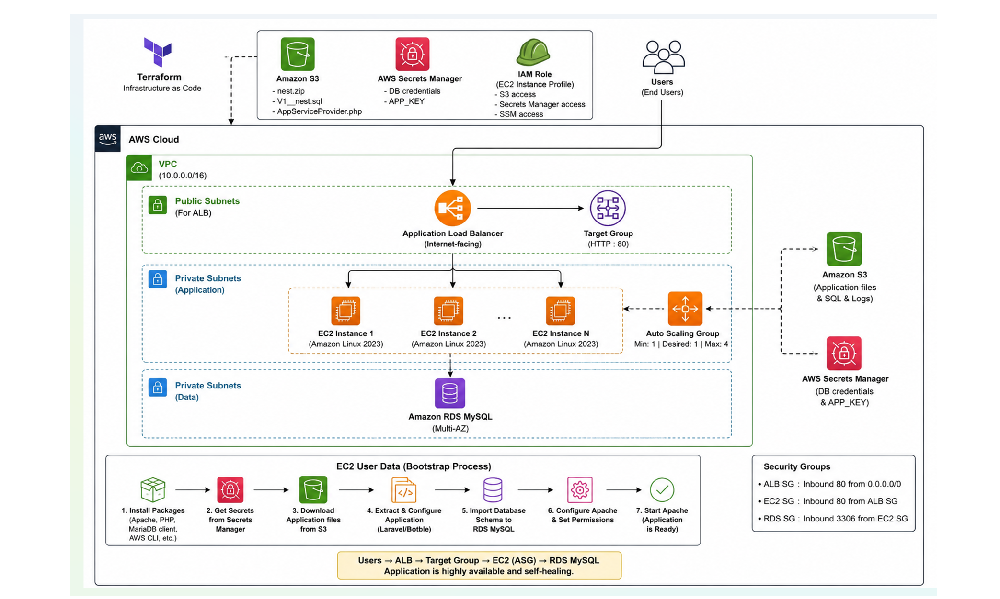
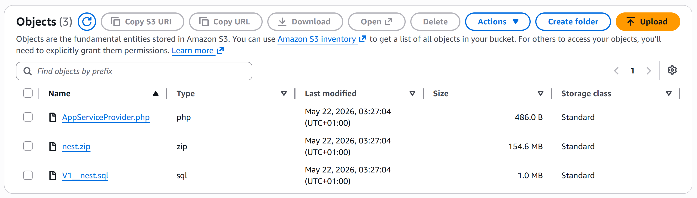
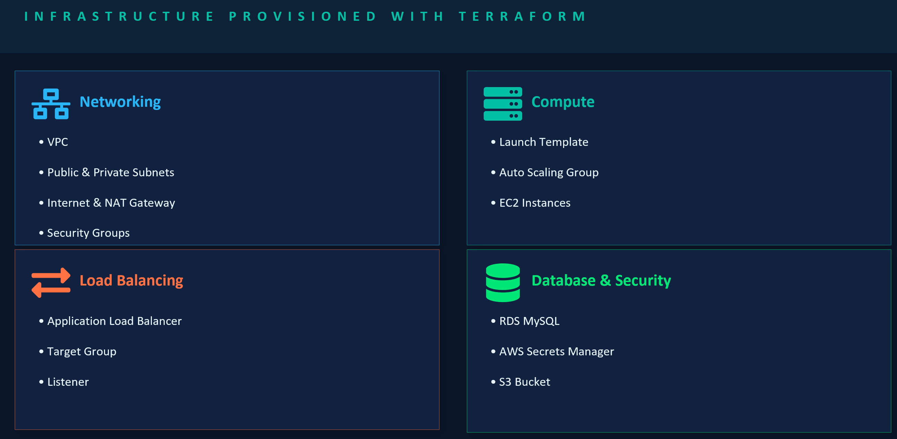
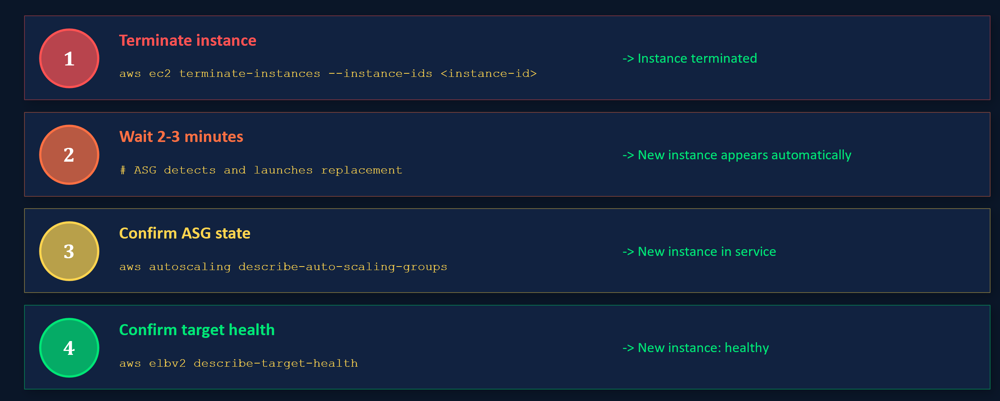
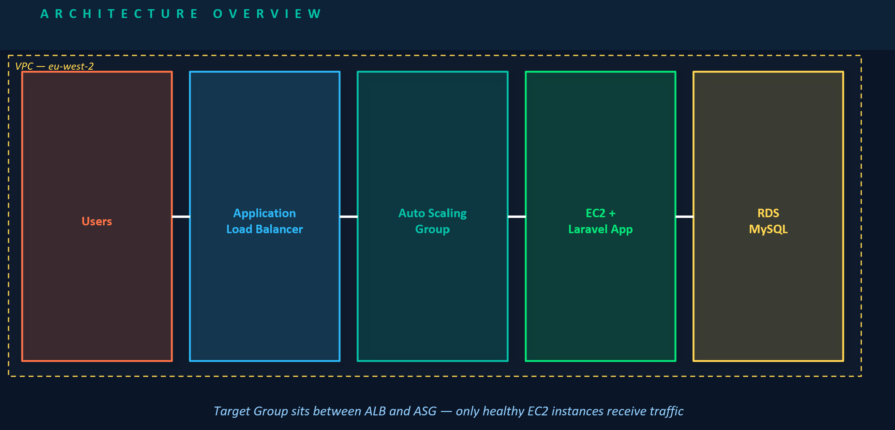
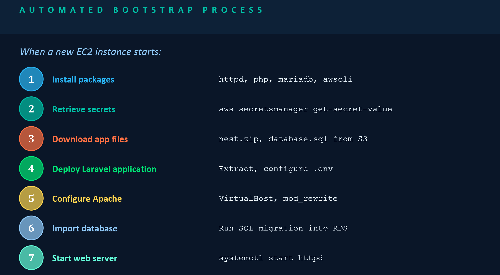

# HIGH AVAILABILITY USING AUTO SCALING GROUPS AND APPLICATION LOAD BALANCER
## AWS ALB + ASG + RDS + S3 + Secrets Manager


---

## Prerequisites
- AWS CLI configured (`aws configure`)
- Terraform >= 1.5 installed
- An EC2 key pair already created in `<YOUR_AWS_REGION>`
- Your S3 bucket `<YOUR_S3_BUCKET_NAME>` with `<YOUR_ASSETS_FOLDER>/` objects uploaded
  

---

## Step 1 — Create the secret in Secrets Manager (one-time setup)

Run this once before `terraform apply`. Replace the password and key with your real values.

```bash
aws secretsmanager create-secret \
  --name "<YOUR_APP_NAME>/db-credentials" \
  --description "<YOUR_APP_NAME> app credentials" \
  --secret-string '{
    "db_name": "<YOUR_DB_NAME>",
    "db_username": "<YOUR_DB_USERNAME>",
    "db_password": "<YOUR_STRONG_PASSWORD>",
    "app_key": "<YOUR_APP_KEY>"
  }' \
  --region <YOUR_AWS_REGION>
```

Verify it was created:
```bash
aws secretsmanager describe-secret \
  --secret-id <YOUR_APP_NAME>/db-credentials \
  --region <YOUR_AWS_REGION>
```

---

## Step 2 — Get your AMI ID

```bash
aws ec2 describe-images \
  --owners amazon \
  --filters "Name=name,Values=al2023-ami-*-x86_64" "Name=state,Values=available" \
  --query "sort_by(Images, &CreationDate)[-1].ImageId" \
  --output text \
  --region <YOUR_AWS_REGION>
```

Copy the output (e.g. `ami-0abc123def456789`) into `terraform.tfvars` as `ami_id`.

---
## PROVISIONING YOUR INFRASTRUCTURE



## Step 3 — Fill in terraform.tfvars

Open `terraform.tfvars` and set:
- `ami_id`   → output from Step 2
- `key_name` → your EC2 key pair name

Everything else is already set. No passwords or keys go in this file.

---

## Step 4 — Initialise Terraform

```bash
terraform init
```

Downloads the AWS provider. Uses `<YOUR_S3_BUCKET_NAME>` S3 bucket to store state.

---

## Step 5 — Plan

```bash
terraform validate
terraform plan -out=tfplan
```

Review what will be created:
- VPC, 2 public subnets, 2 private subnets, IGW, NAT Gateway
- Security groups (ALB / EC2 / RDS)
- RDS MySQL 8.0
- ALB + Target Group + Listener
- IAM Role (S3 read + Secrets Manager read + SSM)
- Launch Template + Auto Scaling Group

---

## Step 6 — Apply

```bash
terraform apply tfplan
```

Takes approximately 10-15 minutes. RDS creation is the longest step (~8 min).

---

## Step 7 — Verify deployment

```bash
# Get the ALB URL
terraform output alb_dns_name

# Check target group health (wait ~5 min after apply)
aws elbv2 describe-target-health \
  --target-group-arn $(terraform output -raw target_group_arn 2>/dev/null || echo "<your-tg-arn>") \
  --region <YOUR_AWS_REGION>

# Check ASG instances
aws autoscaling describe-auto-scaling-groups \
  --auto-scaling-group-names <YOUR_APP_NAME>-asg \
  --region <YOUR_AWS_REGION> \
  --query "AutoScalingGroups[0].Instances[*].{ID:InstanceId,State:LifecycleState,Health:HealthStatus}"

# Watch bootstrap log via SSM (no SSH needed)
# First get an instance ID:
aws ec2 describe-instances \
  --filters "Name=tag:Name,Values=<YOUR_APP_NAME>-asg-instance" "Name=instance-state-name,Values=running" \
  --query "Reservations[0].Instances[0].InstanceId" \
  --output text --region <YOUR_AWS_REGION>

# Then connect:
aws ssm start-session --target <INSTANCE_ID> --region <YOUR_AWS_REGION>
# Inside the session:
tail -f /tmp/nest-bootstrap.log
```

---

## Step 8 — Test auto-scaling



```bash
# Connect to an instance via SSM, then generate CPU load:
stress --cpu 4 --timeout 300

# Watch ASG respond (in another terminal):
watch -n 10 "aws autoscaling describe-auto-scaling-groups \
  --auto-scaling-group-names <YOUR_APP_NAME>-asg \
  --region <YOUR_AWS_REGION> \
  --query 'AutoScalingGroups[0].Instances[*].InstanceId'"
```


## Architecture Overview




```
Internet
    │  HTTP :80
    ▼
[ALB — public subnets <YOUR_AWS_REGION>a/b]
    │
    ▼
[ASG EC2 — private subnets]
    │  boot: pulls app zip from S3
    │  boot: fetches credentials from Secrets Manager
    │  boot: writes .env, runs migration, starts Apache
    │
    ▼
[RDS MySQL 8.0 — private subnets]

Secrets flow:
  Terraform  → reads Secrets Manager → passes to RDS module
  EC2 (boot) → reads Secrets Manager → writes .env file
  No secrets in tfvars, tfstate values are encrypted in S3
```

---

## Security design decisions

| Decision | Reason |
|---|---|
| EC2 in private subnets | Instances unreachable from internet; only ALB is public |
| IAM role on EC2 | No hardcoded AWS credentials on instances |
| Secrets Manager for credentials | Passwords never in Terraform state or code |
| health_check_type = ELB | ASG replaces instances the ALB marks unhealthy |
| SSM Session Manager | Connect to instances without port 22 open to internet |
| S3 backend for state | Terraform state encrypted at rest, shareable with team |



---

## Placeholder Reference

| Placeholder | Description | Example |
|---|---|---|
| `<YOUR_APP_NAME>` | Your application name | `my-app` |
| `<YOUR_AWS_REGION>` | AWS region to deploy into | `eu-west-2` |
| `<YOUR_S3_BUCKET_NAME>` | S3 bucket holding app assets and Terraform state | `my-app-assets` |
| `<YOUR_ASSETS_FOLDER>` | Folder inside the bucket containing app files | `Project-assets` |
| `<YOUR_DB_NAME>` | Database name | `mydb` |
| `<YOUR_DB_USERNAME>` | Database username | `admin` |
| `<YOUR_STRONG_PASSWORD>` | Database password (min 8 chars) | `P@ssw0rd123!` |
| `<YOUR_APP_KEY>` | Laravel APP_KEY from your `.env` | `base64:abc...` |

## Documentation 
 Redgate Flyway https://documentation.red-gate.com/fd/command-line-277579359.html


---

## Step 9 — Cleanup (after the demo)

```bash
terraform destroy
```

Then optionally delete the secret:
```bash
aws secretsmanager delete-secret \
  --secret-id <YOUR_APP_NAME>/db-credentials \
  --force-delete-without-recovery \
  --region <YOUR_AWS_REGION>
```

---